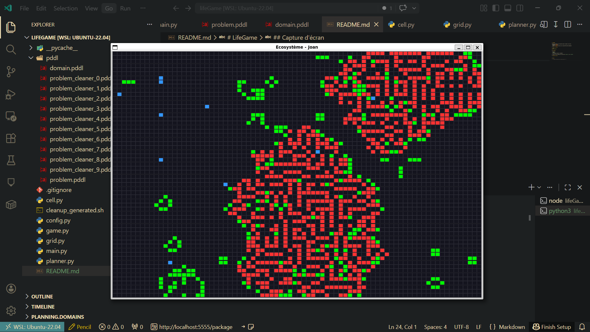

# LifeGame

Simulation Python d'un écosystème inspiré du Game of Life avec :
- cellules **saines**
- cellules **virus**
- agents **cleaner** pilotés par un planner PDDL (Fast Downward)

Le monde évolue à chaque tick selon des règles simples : naissance/survie des cellules saines, propagation et disparition des virus, puis déplacement des cleaners pour traiter les zones infectées.

On combine donc :
- une simulation de grille en temps réel (Pygame)
- une logique de règles configurable (`config.py`)
- une planification d'actions automatique pour les cleaners (`planner.py`, `pddl/`)

## Lancer le projet

```bash
python3 game.py
```

## Prérequis

- Python 3
- `pygame`
- Fast Downward installé localement

Le chemin de Fast Downward est défini dans `planner.py` via `FD_PATH`.

## Paramètres utiles

Les principaux réglages sont dans `config.py` :
- taille de la grille (`GRID_WIDTH`, `GRID_HEIGHT`)
- nombre de cleaners (`CLEANER_COUNT`)
- densité initiale et règles de propagation (`INITIAL_*`, `VIRUS_*`)
- vitesse de simulation (`FPS`)

## Capture d'écran



## Vidéo

<video controls src="export-1775743281298.mp4" title="Title"></video>